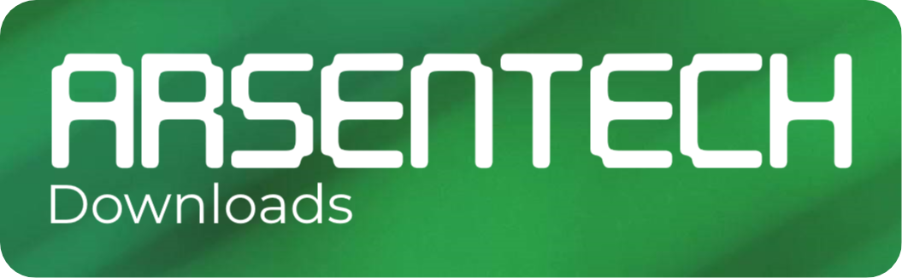

<h3 align="center">Downloads Page of ArsenTech's Official Website</h3>

     <a href="https://github.com/ArsenTech/downloads/issues/new?assignees=&labels=&template=bug_report.md&title=">Report bug</a>
     &nbsp;&middot;&nbsp;
     <a href="https://github.com/ArsenTech/downloads/issues/new?assignees=&labels=&template=feature_request.md&title=">Request Feature</a>

## Table of Contents
- [About](#about)
- [Features Included](#features-included)
- [Bugs and Feature Requests](#bugs-and-feature-requests)
- [Website Speed](#website-speed-tested)
- [Roadmap](#roadmap)
- [Contributing](#contributing)
- [Tech](#tech)
- [FAQs](#faq)
- [Support and Follow](#support-and-follow-arsentech)

## About:
This Page Has Downloads of Softwares, Windows Versions, DOS and Much More. You can Download Files from my collection (that collection isn't massive)
## Features Included
- Dark Mode
- Search Bar
- New Downloader for Wallpapers
## Bugs and Feature Requests
If You want to Report Bug, or Request Feature, Write an Issue and I'll be in touch with you soon.
Downloads Page of ArsenTech's Website. If You want to Report Bug, or Request Feature, Write an Issue and ArsenTech will be in touch with you soon.
## Website Speed (Tested)
- Google PageSpeed Insights Score: **99** on 📱, **100** on 🖥
- Pingdom Website Speed Test Score: **82**
- GTMetrix Score: Performance: **98%**, Structure: **98%**
## Roadmap
This is an Entire Roadmap of a Downloads Page:
### 1.0: Initial Release (2022-2023)
- Initialized the Project
- Added Downloads Section (With Filter Buttons)
- Added Wallpaper Downloads Section (As a Tab)
- Added Feedback and FAQs Section
- Added Loader
### 2.0: **New Look** (2023-now)
- Changed Background to Image
- Maxified HTML Code
- Made Color Contrast Ratio Better
- Fixed Some Spelling Errors
- Changed Loader Animation
- Converted Logo From PNG to SVG
- Updated Navbar
- Added Dark Mode Feature
- Added Search bar
- Made Download Button Animated
- Replaced Wallpaper Downloads Section From Tabs to a Downloader
- Converted Some Icons To SVG Files
- Updated Apple Touch Icon and Added Android Icon
- Added `manifest.json`
- Minified Some JS Files
- Changed Caret Color
## Contributing
Contributions are Always Welcome, but please read both [Code of Conduct](https://github.com/ArsenTech/downloads/blob/main/CODE_OF_CONDUCT.md) and [CONTRIBUTING.md](https://github.com/ArsenTech/downloads/blob/main/CONTRIBUTING.md) for Contributing This Project :-)
## Tech
- **Client:** HTML, CSS, Javascript
- **Tools:** Firebase
- **Icons:** Downloaded From Iconify
## FAQ
#### What's This?
Downloads collection from ArsenTech. This Contains Virus-Free Software selected carefully by ArsenTech. It Includes Windows, Software, Drivers and so on. We're not a replacement for other websites that offer downloads, but we like to provide a nice way to provide you the files easily.  We promise that we won't put any advertisements or charge any, free to download for anyone looking for anyone who wants to easily download a piece a software that you can't easily find or want to go through the hassle.
#### I'm the Copyright owner of these file(s) and I Want to Take These File(s) down!
You can send an email to arsentech5002@gmail.com. Then We'll look into your request and respond it as soon as possible :-)
#### Are the software provided here cracked or modified in any form?
No. We Won't provide cracks, the user must activate it with their own provided licenses. They're Original Copies of the software.
#### Downloads are too slow. What's the problem?
It Depends on your ISP, such as location, plan, and other limitations. Or Your Internet connection is Slow
#### Who made the Wallpapers?
These Desktop Wallpapers are made by ArsenTech

## Support And Follow ArsenTech

> GitHub [@ArsenTech](https://github.com/ArsenTech) &nbsp;&middot;&nbsp;
> [ArsenTech's Website](https://arsentech.github.io) &nbsp;&middot;&nbsp;
> YouTube [@ArsenTech](https://youtube.com/@ArsenTech)