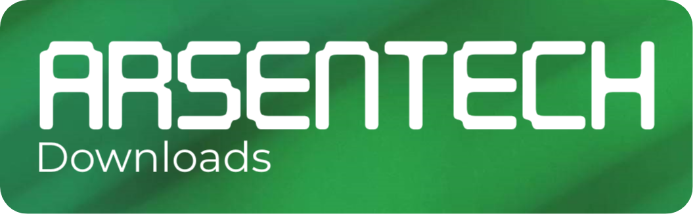

<h1 align="center">Downloads Page of ArsenTech's Official Website</h1>

     <a href="https://github.com/ArsenTech/downloads/issues/new?assignees=&labels=&template=bug_report.md&title=">Report Bug</a>
     &nbsp;&middot;&nbsp;
     <a href="https://github.com/ArsenTech/downloads/issues/new?assignees=&labels=&template=feature_request.md&title=">Request Feature</a>

     
Table of Contents

     <ol>
          <li>
               <a href="#about">About</a>
               <ul>
                    <li><a href="#features-included">Features Included</a></li>
                    <li><a href="#website-speed">Website Speed</a></li>
               </ul>
          </li>
          <li><a href="#built-with">Built with</a></li>
          <li><a href="#versioning">Versioning</a></li>
          <li>
               <a href="#contributing">Contributing</a>
               <ul>
                    <li><a href="#top-contributors">Top Contributors</a></li>
               </ul>
          </li>
          <li><a href="#faq">FAQs</a></li>
          <li><a href="#star-history">Star History</a></li>
     </ol>

## About
This Page Has Downloads of Softwares, Windows Versions, DOS and Much More. You can Download Files from my collection (that collection isn't massive).
### Features Included
- Dark Mode
- Search Bar
- New Downloader for Wallpapers
- External Download Links
- Animated Download Button
### Website Speed
- **Google PageSpeed Insights Score**: 100 on Mobile, **100** on PC
- **Pingdom Website Speed Test Score**: 97
- **GTMetrix Score**: Performance - 99%, Structure - 98%

## Built with
- 
- 
- 

## Versioning
This website follows [Semantic Versioning](https://semver.org/). You can view the full [Changelog](https://github.com/ArsenTech/downloads/blob/main/CHANGELOG.md) for details on each website version.

## Contributing
Contributions are Always Welcome! Please read both [Code of Conduct](https://github.com/ArsenTech/downloads/blob/main/CODE_OF_CONDUCT.md) and [CONTRIBUTING.md](https://github.com/ArsenTech/downloads/blob/main/CONTRIBUTING.md) before contributing.
### Top Contributors

## FAQ
#### What's This?
Downloads collection from ArsenTech. This Contains Virus-Free Software selected carefully by ArsenTech. It Includes Windows, Software, Drivers, and so on. We're not a replacement for other websites that offer downloads, but we like to provide a nice way to provide you the files easily.  We promise that we won't put any advertisements or charge any, free to download for anyone looking for anyone who wants to easily download a piece software that you can't easily find or want to go through the hassle.

#### I'm the Copyright owner of these file(s) and want to Take These File(s) down!
Please feel free to [contact me](https://arsentech.github.io/#contact)! Then We'll look into your request and respond to it as soon as possible :-)

#### Are the software provided here cracked or modified in any form?
No. We Won't provide cracks, the user must activate it with their own provided licenses. They're Original Copies of the software.

#### Downloads are too slow. What's the problem?
It Depends on your ISP, such as location, plan, and other limitations. Or Your Internet connection is Slow

#### Who made these Coding Wallpapers?
These Coding Related Desktop Wallpapers are made by ArsenTech

#### Do You Provide Malware Downloads
No. I Won't Provide Malware Downloads Because It Can Infect Someone's PC and It is Unethical. I don't want to Share Some Malware with Someone Just For Their Safety.

#### Why Did You Remove Windows Vista - 11 Versions?
Due to space limitations, I’ve removed the Windows Vista - 11 versions from this collection. Instead, I’ve linked to the official sources for these versions to ensure that you’re getting the most authentic and up-to-date files directly from the provider. Some versions are linked from the Internet Archive. While we strive to provide reliable sources, please verify file integrity before use.

#### Why don't you display file sizes and dates for the downloads anymore?
Due to changes in storage methods (from Firebase to GitHub) and Github API limitations, I am unable to display the file sizes and creation dates on the website. However, you can see the file size by downloading the file to your device. Once downloaded, the file size is readily available through your computer's file explorer. If you require the file size of any specific file, don't hesitate to contact me, and I will be happy to share it!
## Star History

## Support And Follow ArsenTech

> GitHub [@ArsenTech](https://github.com/ArsenTech) &nbsp;&middot;&nbsp;
> YouTube [@ArsenTech](https://youtube.com/@ArsenTech) &nbsp;&middot;&nbsp;
> Patreon [ArsenTech](https://www.patreon.com/ArsenTech) &nbsp;&middot;&nbsp;
> [ArsenTech's Website](https://arsentech.github.io)